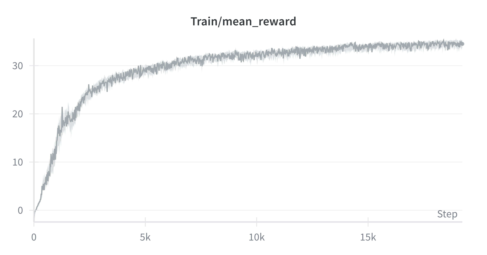
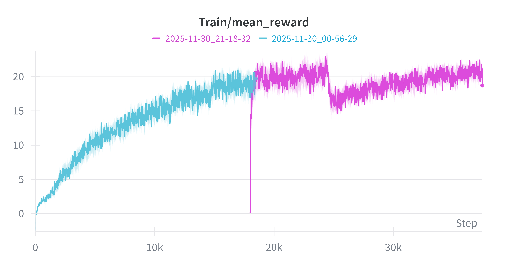

# The mjlab Test

## 1. Overview
This repository contains my implementation for the mjlab Technical Test.  
The objective was to reproduce the BeyondMimic-style motion tracking policy on the Unitree G1 robot and extend it with a modified observation space (body link poses and velocities in the robot's local frame).
I successfully:
- Set up mjlab + MuJoCo-Warp
- Trained a baseline tracking policy using LAFAN1 `dance1_subject1`
- Implemented a new tracking task with a modified observation space
- Trained and evaluated both policies
- Compared performance through metrics and rollout videos

## 2. Modified Observation Space (Bonus Task)

For the bonus task, I replaced the default joint-space motion command with a Cartesian, link-based representation expressed entirely in the robot’s local frame. I implemented a new `MotionCommandLocal` that computes each body link’s position, a compact 2-column orientation representation, and linear/angular velocities by subtracting the anchor transform and projecting all quantities into the anchor frame. The environment config swaps this command in, removes all `joint_pos` and `joint_vel` observations, and keeps the rest of the tracking pipeline unchanged. This yields a joint-invariant, geometry-based observation intended to encourage more general and link-based tracking, though it produced lower tracking accuracy in this setting.

## 3. Results

### Rollout Videos
- **Baseline Policy Rollout:** [docs/static/baseline.mp4](docs/static/baseline.mp4)
- **Modified Obs Policy Rollout:** [docs/static/bonus.mp4](docs/static/bonus.mp4)  

### Mean Reward Training Curves
- Baseline training curves: 
- Modified observation training curves: 
*Note: The training curve is split into two runs due to limited Slurm GPU time. The first run trained for ~6 hours before terminating, and I resumed training in a second run.


### Comparison

| Metric | Baseline | Modified Obs |
|--------|----------|--------------|
| Mean reward | 34.513155 | 18.718284 |
| Body pos error | 0.042367 | 0.096465 |
| Body ori error | 0.156896 | 0.343548 |
| Joint pos error | 0.640096 | 1.240289 |
| Episode length | 495.52 | 425.38 |

## 4. Discussion

The baseline model converges quickly and achieves strong tracking accuracy because joint positions and velocities provide a compact, well-aligned signal for humanoid control. In contrast, the modified observation model learns much more slowly and converges to a slightly worse final reward since the local link-based representation is higher-dimensional and less structured and requires the policy to learn implicit kinematic relationships (e.g., joint constraints, link connectivity) that the baseline receives directly through `qpos/qvel`. While the link-based observation underperformed in this experiment, it aligns with the goal of building a unified visuomotor model that works across different robot embodiments. Unlike joint-space inputs, link poses and velocities form a general geometric representation suitable for multi-stream sequence models. With better normalization or auxiliary kinematic objectives, this approach could improve and support more scalable cross-embodiment motor learning.

## 5. How to Run

1. Follow the [mjlab documentation](https://github.com/mujocolab/mjlab) to install MuJoCo-Warp and set up motion imitation

2. Train and Evaluate
```bash
uv run train Mjlab-Tracking-Flat-Unitree-G1-LocalObs --registry-name your-org/motions/motion-name --env.scene.num-envs 4096

uv run play Mjlab-Tracking-Flat-Unitree-G1-LocalObs --wandb-run-path your-org/mjlab/run-id 
```
